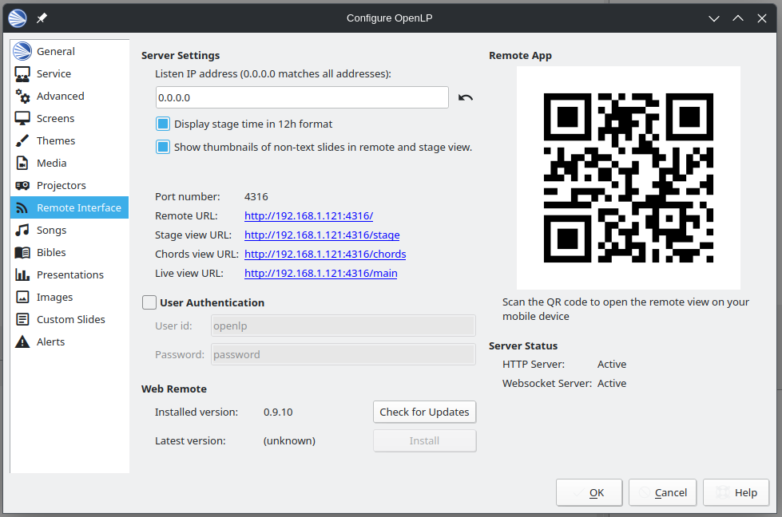

# openlp-lyric-stage

A 'stage' to render OpenLP lyrics for use with Open Broadcast Studio

## Installation

1. Open OpenLP
2. Select menu: Tools > Open Data Folder
3. Create a new folder named `stages` (if necessary)
4. Extract the files of the latest release in that folder
   You should now have a directory structure something like:
   ```
   ├── stages
   │   ├── lyric
   │   │   ├── stage.css
   │   │   ├── stage.html
   │   │   └── stage.js
   ```
5. Display some song lyrics in OpenLP
6. Open OpenLP's remote 'stage' by selecting menu Settings > Configure OpenLP > Remote Interface and clicking on 'Stage view URL'
   
7. Append 'lyric' to this address and press return

